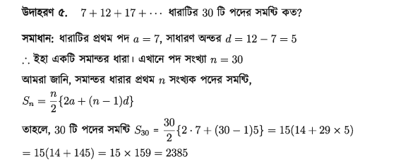

# সমাধান

সমাধানটি দুই ভাবে করা যেতে পারে

- প্রোগ্রামিং দক্ষতা ব্যবহার করে
- গনিতের দক্ষতা ব্যবহার করে।

# প্রোগ্রামিং

এই টা খুব সহজ উপায় ১ থেকে ১০০ বা ১০০০০০ বা ১০০০০০০০ পর্যন্ত একটা লুপ চালিয়ে প্রত্যেক ভ্যালুকে স্টোর করব। করে সেটা প্রিন্ট করে দিলেই হয়ে যাবে। তবে সুবিধার জন্য একটা ফাংশন ব্যবহার করব এবং শেষ সংখ্যা কে আর্গুমেন্ট আকারে নিব। তাহলে কাজ টা করতে একটু সুবিধা হবে।

```ts
function simple_sum(n: number): number {
  let result = 0;
  for (let i = 1; i <= n; i++) {
    result += i;
  }
  return result;
}
```

এবার খরচের হিসাবা টা করি। আপাতত সময় তা বাদ দিই। এখানে অপারেশন হচ্ছে Total = n + n = 2n।
তাহলে

- ১০০ এর জন্য খরচ হবে ২০০ পয়সা = ২ টাকা
- ১০০০০০ এর জন্য খরচ হবে ২০০ পয়সা = ২০০০ = ২ হাজার টাকা
- ১০০০০০০০ এর জন্য খরচ হবে ২০০ পয়সা = ২০০০০০ = ২ লক্ষ টাকা
  সোজা হিসাবে শেষ সংখ্যা যত বাড়বে , খরচের পরিমান তত টায় বৃদ্ধি পাবে।

# গনিত

গনিতে ধারা (Series) নামে একটা টপিক আছে। সেই জিনিস টা ব্যবহার করলেই এইটা খরচ একেবারে অত্যাধিক পরিমানে কমানো সম্ভব।

এটা নবম-দশম শ্রেনির ধারা নামক অধ্যায় এর একাংশ।
এখানে n সংখ্যক পদের যে সমষ্টির যে সূত্র টা আছে। সেটা ব্যবহার করলে এই খরচ একেবারে সর্বনিম্ন হয়ে যাবে। আর সব থেকে মজার ব্যবহার হল শেষ সংখ্যা যত বড়ই হোক না কেন খরচ একই থাকবে।
এখানে অপারেশন হচ্ছে ৬ টা অপারেশন অর্থাৎ ৬ পয়সা খরচ হচ্ছে। সেটা ১ কোটি বা ২ কোটি ই হোক না কেন।

```ts
function math_sum(n: number): number {
  const result = (n / 2) * (2 * 1 + (n - 1) * 1);
  return result;
}
```

তবে এখানে অপারেশন আরো একটু কমানো যেতে পারে। যদি কিছু মান বসিয়ে দেওয়া যায় যেমন a = 1 এবং d = 1 বসিয়ে দেওয়া যায় তাহলে তখন সমষ্টির সূত্র হবে `n(n-1)`। এখনাএ অপারেশন হবে শুধুমাত্র ৩ টা। খরচ অর্ধেক কমে গেল।

```ts
function math_sum2(n: number): number {
  const result = n * (n - 1);
  return result;
}
```

# সময়

সময় এর বিষয়ে তেমন কিছু বলা নেই। তাই নিদির্ষ্ট হিসাব করা সম্ভব না। তবে প্রথম টার থেকে দ্বিতীয় টার সমধান তুলনামূলক ভাবে অনেক অনেক কম সময় নিবে।
